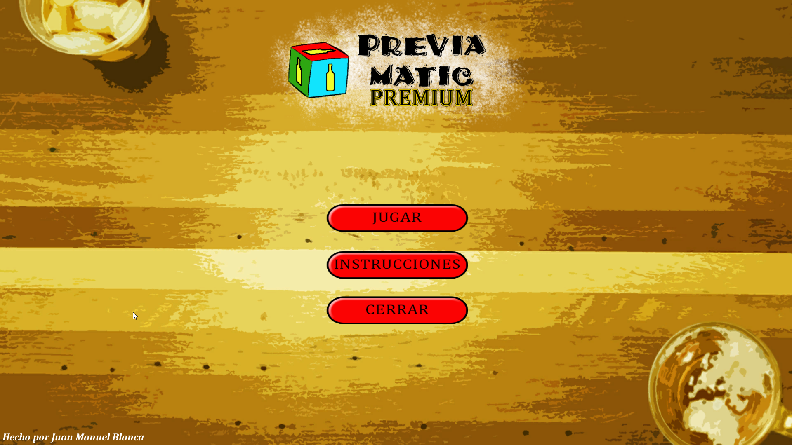
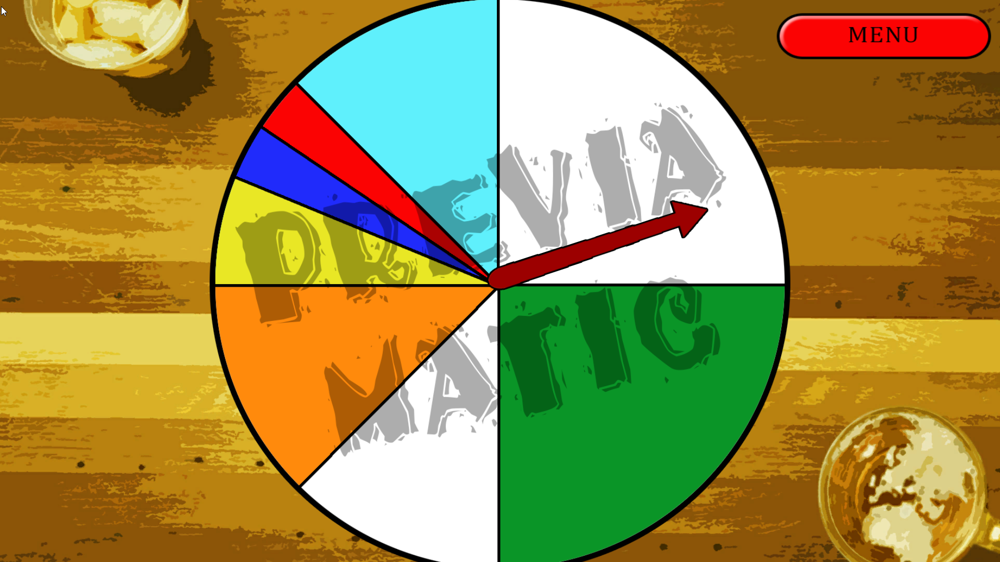
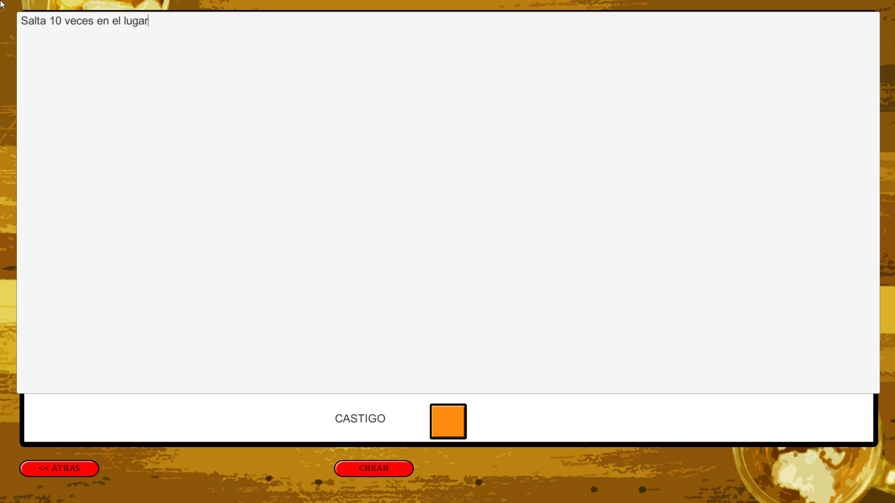
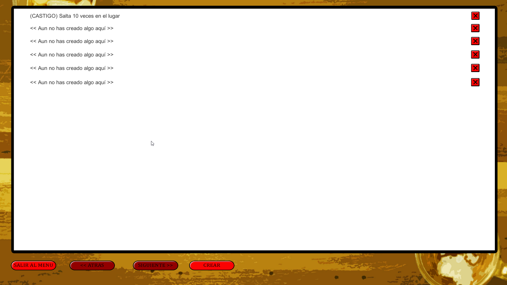
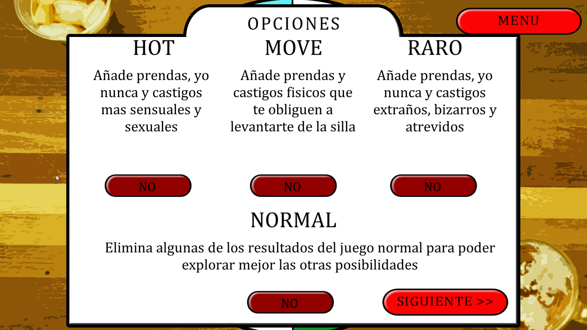

# Customizable Decision Wheel

A customizable decision wheel built in Unity where users can create their own outcomes, save them, and spin the wheel to generate a random result.

This project was originally developed as a personal project and is preserved as a legacy Unity project as part of my development portfolio.

---

## Demo Video

---

## Download / Play

You can download and play the application here:
https://juanmasprojects.itch.io/customizable-decision-wheel

---

## Screenshots

---

## Features

- Customizable wheel outcomes
- Ability to create and save custom result lists
- Random selection system
- Multiple menus and scenes
- Persistent data stored between sessions
- Simple and intuitive UI navigation

---

## How It Works

1. Open the application
2. Choose a game mode or create your own custom results
3. Spin the wheel
4. The wheel randomly selects a result
5. Results you create can be saved and reused in future sessions

---

## Technical Details

Developed using Unity and C#.

Main systems implemented in the project:
- Scene management
- UI navigation system
- Random selection logic
- Data persistence
- Custom result editor
- Menu and navigation flow
- Multiple scenes architecture

---

## Project Structure

Assets/
├── Scenes/
├── Script/
├── Imagenes/
├── Fuentes/
ProjectSettings/

---

## About This Project

This project was originally developed several years ago as a personal Unity project.  
The goal was to create a customizable decision wheel for social games and random decision making.

The project is uploaded in its original structure as a legacy project and serves as part of my software development portfolio.

---

## Author

Juan Manuel Blanca